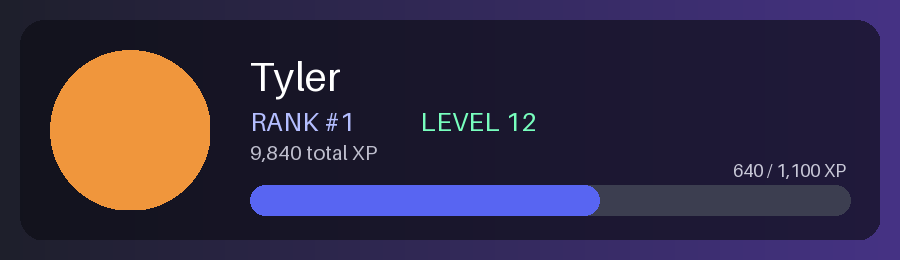

# Discord Bot

[](https://github.com/Tyler-Dog/Discord-bot/actions/workflows/ci.yml)


A modular, Docker-ready Discord bot built on `discord.py` with slash commands, a SQLite persistence layer, persistent UI components, background tasks and an optional Claude integration.



## Features

| Module | What it does |
| --- | --- |
| 🤖 **AI** | `/ask` — chat with Claude from Discord (Anthropic Messages API, per-user cooldown, long answers auto-split) |
| 📈 **Leveling** | XP for chatting (no message-content intent needed), `/rank` renders a **generated rank-card image** with Pillow, `/leaderboard` |
| 🛡️ **Moderation** | `/warn` `/warnings` `/clearwarnings` `/kick` `/ban` `/timeout` `/untimeout` `/purge` with role-hierarchy safety checks and DM notices |
| 📊 **Polls** | `/poll` with up to 5 options, live progress bars, change/remove your vote, optional auto-close. Buttons are **persistent** (`DynamicItem`) so polls keep working after restarts |
| ⏰ **Reminders** | `/remind 2h30m take a break` — stored in SQLite, delivered in-channel (or by DM), survive restarts |
| 🎫 **Tickets** | Button-based support tickets with HTML transcripts |
| 👋 **Welcome** | Configurable welcome embeds |
| 🎮 **ARC Raiders** | `/arcitem` `/arcweapon` `/arcsearch` `/arctraders` powered by the MetaForge API |
| 🧰 **Utility** | `/botstats` `/avatar` `/serverinfo` `/userinfo` `/helpme` `/ping` `/hello` |

Engineering touches: central slash-command error handler (cooldowns, missing permissions, logging), one-time command sync at startup, a shared async SQLite layer (`utils/db.py`), pure-function logic covered by pytest, and GitHub Actions CI (ruff + pytest).

## Setup

1. Create an application in the [Discord Developer Portal](https://discord.com/developers/applications), add a bot, and copy the token.
2. Enable the **Server Members Intent** (needed for welcome messages). The Message Content intent is **not** required.
3. Invite it with the `bot` and `applications.commands` scopes. Recommended permissions: Send Messages, Embed Links, Attach Files, Manage Channels, Manage Messages, Kick/Ban Members, Moderate Members.
4. Copy the env template and fill it in:

```bash
cp .env.example .env
```

| Variable | Required | Purpose |
| --- | --- | --- |
| `DISCORD_TOKEN` | yes | Bot token |
| `GUILD_ID` | no | Sync commands instantly to one dev server |
| `ANTHROPIC_API_KEY` | no | Enables `/ask` |
| `ANTHROPIC_MODEL` | no | Override the Claude model used by `/ask` |
| `DATA_DIR` | no | Where `bot.db` and config JSON live (default `./data`) |

## Run

Locally:

```bash
python -m venv .venv && source .venv/bin/activate   # Windows: .venv\Scripts\activate
pip install -r requirements.txt
python bot.py
```

With Docker:

```bash
docker compose up -d --build
```

Data persists in `./data` (mounted into the container).

## Development

```bash
pip install -r requirements-dev.txt
ruff check .
pytest
```

## Project layout

```
bot.py            entry point, error handler, extension loading
cogs/             one file per feature module
utils/db.py       async SQLite wrapper + schema
utils/timeparse.py  "1h30m" -> seconds
tests/            unit + cog smoke tests
```

Never commit your real `.env` file or token.
