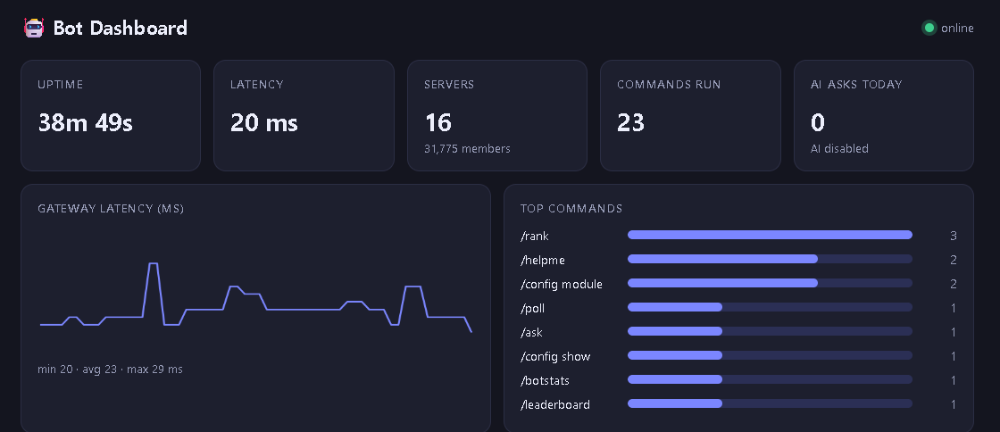
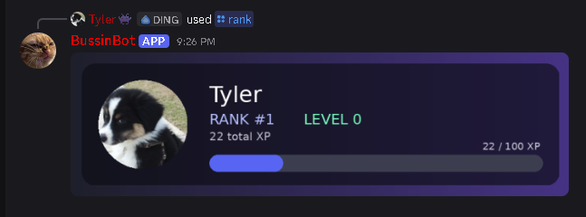
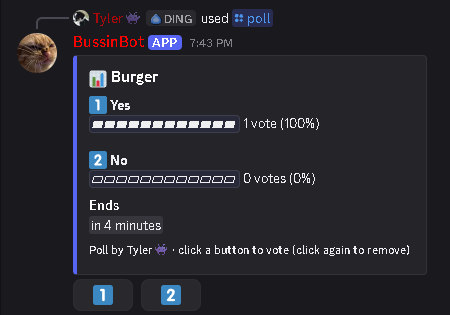
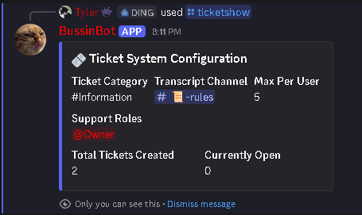
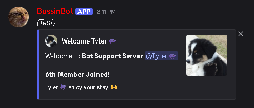
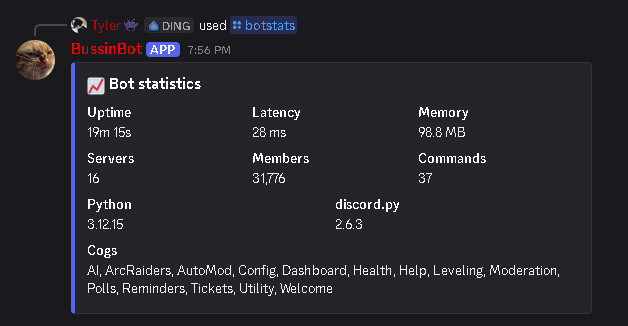
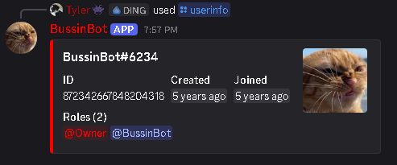
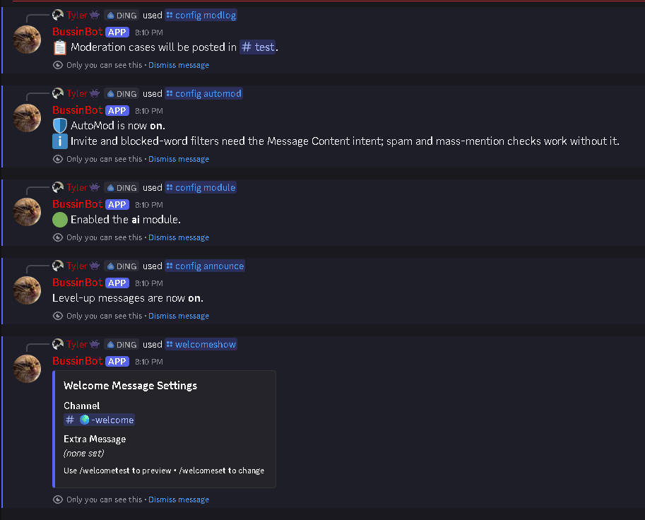

# Discord Bot

[](https://github.com/Tyler-Dog/Discord-bot/actions/workflows/ci.yml)


A modular, Docker-ready Discord bot built on `discord.py`: slash commands, a SQLite persistence layer, persistent UI components, background tasks, a built-in web dashboard and a deep **Claude** integration (streaming, tool use, vision, structured output).

<p align="center">
  <br>
  <sub>The built-in web dashboard, live from the running bot (uptime, gateway latency, top commands)</sub>
</p>

## In action

Real screenshots from the bot running in Discord.

<table>
  <tr>
    <td align="center"><br><sub><code>/rank</code> — generated rank card</sub></td>
    <td align="center"><br><sub><code>/poll</code> — live bars, persistent buttons, auto-close</sub></td>
  </tr>
  <tr>
    <td align="center"><br><sub><code>/ticketshow</code> — ticket system configuration</sub></td>
    <td align="center"><br><sub><code>/welcometest</code> — welcome embed preview</sub></td>
  </tr>
  <tr>
    <td align="center"><br><sub><code>/botstats</code> — running in 16 servers</sub></td>
    <td align="center"><br><sub><code>/userinfo</code></sub></td>
  </tr>
</table>

**Per-server configuration with `/config`:**

<p align="center"></p>

## Highlights

### 🤖 Claude integration
| Feature | Details |
| --- | --- |
| **`/ask`** | Streams the answer by live-editing the message, **remembers the conversation** per user and channel (1 h window, `/askreset` to clear), and accepts **image attachments** (vision). |
| **Tool use** | Claude can call the bot's own functions mid-answer: look up ARC Raiders items, read *your* XP rank, fetch the leaderboard, **set a reminder**, check server info or the time. The footer shows which tools were used. Tools only ever act for the invoking user. |
| **`/summarize`** | Catch up on a busy channel: overview, topics, decisions, open questions and action items. |
| **AI ticket triage** | Opening a ticket shows a modal (subject + description). Claude classifies it with a forced **structured tool call** (category, priority, summary) and prepares a suggested reply that only **staff** can reveal. |
| **Cost & safety** | Per-user cooldown and a daily request cap (`AI_DAILY_LIMIT`), untrusted text is fenced and treated as data, output is clamped to known values, and everything degrades gracefully without an API key. |

The API client (`utils/claude.py`) is a small hand-rolled SSE implementation with an agentic tool loop and is unit-tested against an in-process fake Anthropic server.

### 🛠️ Server management
- **`/config`** — per-server settings: turn modules on/off, tune XP rates, toggle level-up messages, set the mod-log channel, AutoMod and level-role rewards. Disabled modules are blocked centrally by a custom command tree.
- **Moderation + audit trail** — `/warn` `/kick` `/ban` `/timeout` `/untimeout` `/purge` `/warnings` `/clearwarnings`, role-hierarchy safety checks, DM notices, and every action stored as a numbered **case** (`/cases`) and posted to the mod-log channel.
- **AutoMod** (off by default) — spam bursts (auto-timeout), mass mentions, invite links and blocked words.
- **Leveling** — XP for chatting (no message-content intent needed), `/rank` renders a **generated rank card** with Pillow, `/leaderboard`, and **role rewards** at configured levels.


### 🎮 Community features
**Polls** (persistent `DynamicItem` buttons that survive restarts, live bars, auto-close) · **Reminders** (`/remind 2h30m ...`, stored in SQLite) · **Tickets** (modal intake, HTML transcripts) · **Welcome** embeds · **ARC Raiders** lookups (`/arcitem` `/arcweapon` `/arcsearch` `/arctraders`) · **Utility** (`/botstats` `/avatar` `/serverinfo` `/userinfo` `/helpme`).

### 📈 Web dashboard
Live uptime, latency sparkline, top commands, per-server leaderboard and an activity feed — served by the bot itself (aiohttp, no extra dependencies, no framework). Binds to `127.0.0.1:8787` by default and refuses to listen publicly unless `DASHBOARD_TOKEN` is set. All data is rendered with `textContent`, never `innerHTML`.

### 🚀 Production touches
Docker `HEALTHCHECK` backed by a gateway heartbeat file · structured JSON logs (`LOG_FORMAT=json`) · central slash-command error handler · one-time command sync · shared async SQLite layer · a Fly.io starter config and a [hosting guide](docs/HOSTING.md) · pytest suite + ruff + GitHub Actions.

## Setup

1. Create an application in the [Discord Developer Portal](https://discord.com/developers/applications), add a bot and copy the token.
2. Enable the **Server Members Intent**. The **Message Content Intent** is optional (see below).
3. Invite it with the `bot` and `applications.commands` scopes. Recommended permissions: Send Messages, Embed Links, Attach Files, Manage Channels, Manage Messages, Manage Roles, Kick/Ban Members, Moderate Members.
4. `cp .env.example .env` and fill it in:

| Variable | Required | Purpose |
| --- | --- | --- |
| `DISCORD_TOKEN` | yes | Bot token |
| `GUILD_ID` | no | Sync commands instantly to one dev server |
| `ANTHROPIC_API_KEY` | no | Enables `/ask`, `/summarize` and ticket triage |
| `ANTHROPIC_MODEL` | no | Claude model to use |
| `AI_DAILY_LIMIT` | no | Requests per user per day (default 40, `0` = unlimited) |
| `MESSAGE_CONTENT_INTENT` | no | `true` enables `/summarize` and AutoMod's invite/word filters (turn on the privileged intent in the portal first) |
| `DASHBOARD_ENABLED` / `_HOST` / `_PORT` / `_TOKEN` | no | Dashboard settings (default `127.0.0.1:8787`; a token is required for any non-local host) |
| `LOG_FORMAT` | no | `json` for structured logs |
| `DATA_DIR` | no | Where `bot.db` and config JSON live (default `./data`) |

**Privacy note:** XP counts messages but never reads their content. Message content is only requested when you opt in with `MESSAGE_CONTENT_INTENT=true`, and `/summarize` sends the selected messages to Anthropic's API.

## Run

```bash
python -m venv .venv && source .venv/bin/activate   # Windows: .venv\Scripts\activate
pip install -r requirements.txt
python bot.py
```

With Docker (dashboard at <http://localhost:8787>, data persisted in `./data`):

```bash
docker compose up -d --build
docker compose ps        # shows (healthy) once the bot is connected
```

**New to hosting?** See the step-by-step [hosting guide](docs/HOSTING.md) (your own PC, Railway or Fly.io).
Change the dashboard port with `DASHBOARD_PORT` if 8787 is taken. The Fly.io starter config lives in `deploy/`.

## Development

```bash
pip install -r requirements-dev.txt
ruff check .
pytest
```

The suite covers the level maths, duration parsing, rank-card rendering, SSE parsing and the tool-use loop (against a fake Anthropic API), the full `/ask` flow (streaming, tools, memory, quota), settings, AutoMod rules, triage normalization, dashboard endpoints and auth, the Docker healthcheck, and a smoke test that loads every extension the bot starts with.

## Project layout

```
bot.py                  entry point, command tree, error handler
cogs/                   one module per feature (ai, leveling, moderation, automod, config, polls, ...)
utils/                  Claude client, AI tools, SQLite layer, settings, mod-log, helpers
dashboard/              dashboard front-end (index.html)
deploy/                 Fly.io starter config
scripts/                healthcheck.py (used by the Docker HEALTHCHECK)
docs/                   hosting guide + screenshots
tests/                  unit, integration and smoke tests
data/                   runtime data (SQLite database, config JSON) — mounted as a volume
pyproject.toml          ruff + pytest configuration
```

Never commit your real `.env` file or token.
